# Small Network Environment – Packet Tracer

## Project Overview
This project simulates a small enterprise network environment using Cisco Packet Tracer. 
The network demonstrates VLAN segmentation, inter-VLAN routing, DHCP services, and dynamic routing using OSPF across both LAN and WAN segments.

The goal of this project is to practice designing, configuring, and verifying connectivity in a multi-VLAN, multi-router environment.

---

## Initial Network Topology

This topology consists of multiple switches, three routers connected via serial links to simulate a WAN, and multiple LAN segments with dynamic IP addressing.

---

## VLAN and LAN Configuration (Initial LAN)

Two VLANs were created:
- **VLAN 2**
- **VLAN 4**

These VLANs were subnetted using **VLSM** to support a specific number of hosts per VLAN.

Both VLANs are connected to **Switch 1**, which is trunked to **Switch 2**.

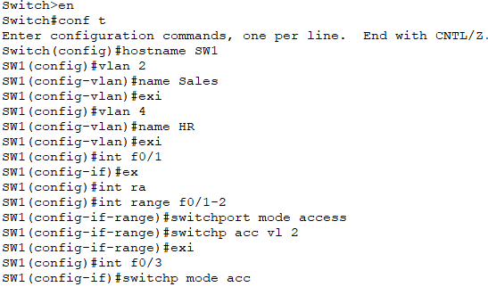
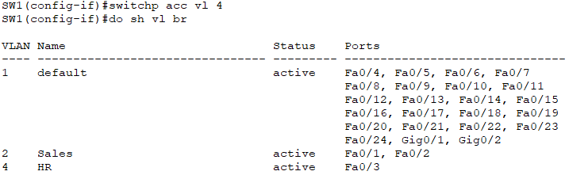

## Switch 2 configuration ##

Trunking allows VLAN traffic to be forwarded to **Router 1**, where inter-VLAN routing is performed.

---

## Inter-VLAN Routing and DHCP

Router 1 is configured to:
- Perform inter-VLAN routing
- Provide DHCP services for each VLAN

Each VLAN receives dynamic IP addressing, allowing hosts in different VLANs to communicate while remaining logically separated.

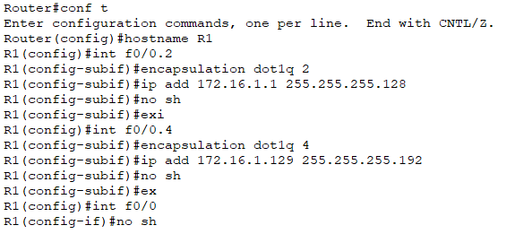

The **ip dhcp excluded address** will be used as the gateway address.

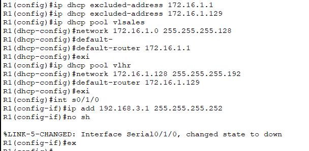

---

## WAN Simulation and Initial Connectivity Issue

Each serial link is assigned an IP address.  
To simulate a WAN:
- Router 1 connects to Router 2 via a serial link
Router 2 
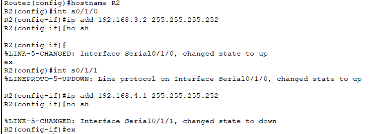

- Router 2 connects to Router 3 via another serial link
Router 3
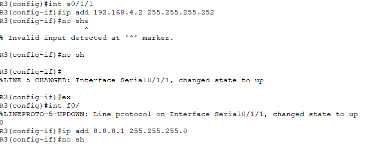

Hosts were able to communicate within the same LAN, but routing between LAN and WAN segments was unavailable due to the absence of a dynamic routing protocol.

Pings inside the LAN can successfully have connectivity by the trunked port.
Vlan 2 PC ping to Vlan 4 PC

## External Network Simulation

Router 3 connects to a server configured with **8.8.8.8**, simulating an external resource such as Google DNS.

This allows verification of end-to-end connectivity across the entire network.

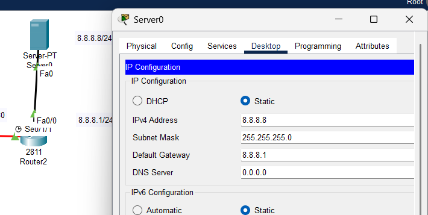

---

## OSPF Configuration
Ip Route table before OSPF
Router 1

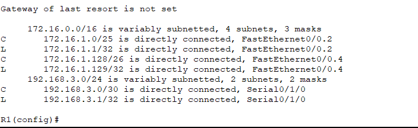

Router 2

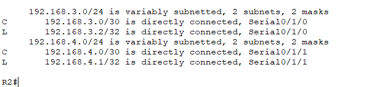

Router 3

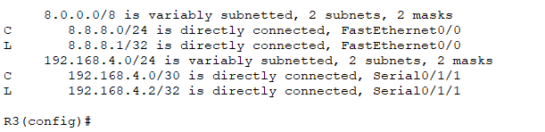

**OSPF** is configured on all routers to allow dynamic routing between LAN and WAN segments.
Router 1

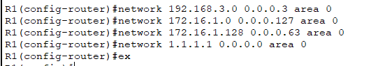

Router 2

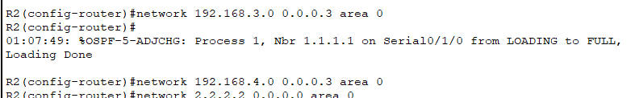

Router 3

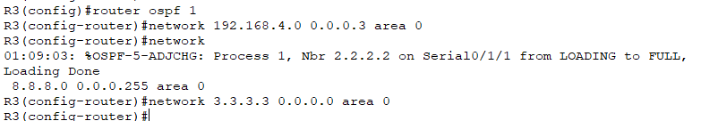

**Verification of ip route table after configuring OSPF**

IP route table Router 1

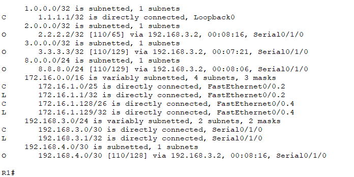

IP route table Router 2

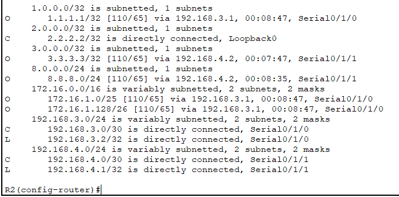

IP route table Router 3

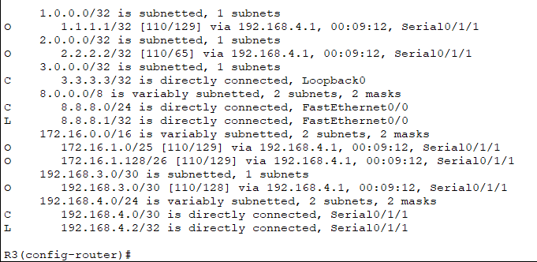

OSPF was implemented to dynamically advertise all VLAN, WAN, and loopback networks, restoring full end-to-end connectivity.

---

## Loopback Interfaces and Router IDs

Each router includes a loopback interface used as its OSPF Router ID:
- Router 1: `1.1.1.1/32`
- Router 2: `2.2.2.2/32`
- Router 3: `3.3.3.3/32`

Loopback interfaces provide stable router identification and simulate remote management access.

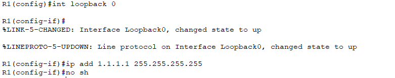

---

## Network Expansion (Additional LAN)

An additional LAN was created by connecting **Switch 2** to **Switch 3**.

Two new VLANs were configured:
- **VLAN 10 – 172.16.10.0/24**
- **VLAN 20 – 172.16.20.0/25**

These VLANs use standard subnetting (not VLSM). Router 1 was updated to support inter-VLAN routing, DHCP, and OSPF advertisements for the new networks.

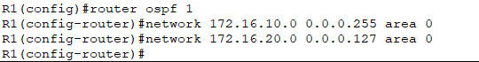

Updated Ip route table of Router 1

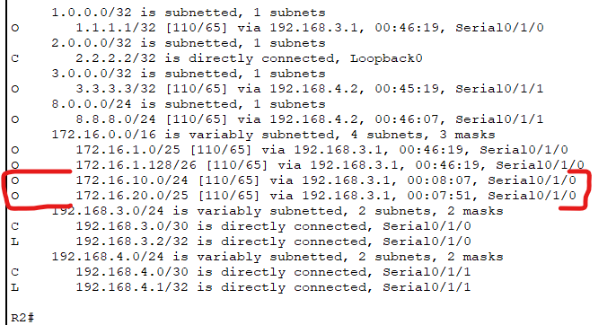

---

## Verification and Connectivity

Connectivity was verified by:
- Confirming DHCP address assignment
- Testing inter-VLAN communication
- Verifying OSPF neighbor relationships
- Pinging the simulated external server

All VLANs and network segments successfully communicate with each other.

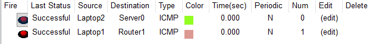

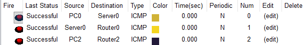

---
## What This Project Demonstrates
- VLAN creation and trunking
- VLSM-based subnetting
- Inter-VLAN routing
- DHCP configuration
- OSPF dynamic routing
- WAN simulation using serial links
- Network scalability and expansion
- Troubleshooting and verification skills

---

## Skills Applied
- Cisco IOS configuration
- VLAN design and trunking
- VLSM subnet planning
- Inter-VLAN routing (Router-on-a-Stick)
- DHCP server configuration
- OSPF single-area routing
- WAN serial link configuration
- Network troubleshooting and verification

