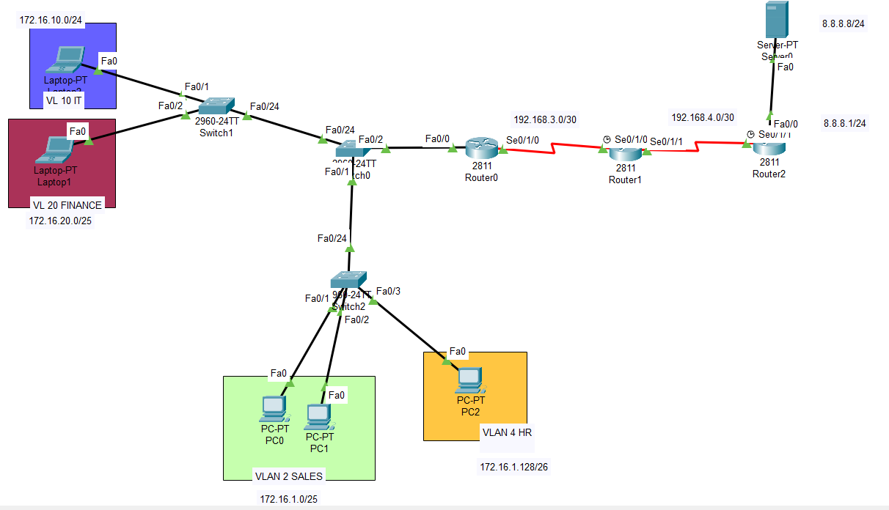

# Small Network Environment – Packet Tracer

## Project Overview
This project simulates a small enterprise network environment using Cisco Packet Tracer. 
The network demonstrates VLAN segmentation, inter-VLAN routing, DHCP services, and dynamic routing using OSPF across both LAN and WAN segments.

The goal of this project is to practice designing, configuring, and verifying connectivity in a multi-VLAN, multi-router environment.

---

## Network Topology

This topology consists of multiple switches, three routers connected via serial links to simulate a WAN, and multiple LAN segments with dynamic IP addressing.

---

## VLAN and LAN Configuration (Initial LAN)

Two VLANs were created:
- **VLAN 2**
- **VLAN 4**

These VLANs were subnetted using **VLSM** to support a specific number of hosts per VLAN.

Both VLANs are connected to **Switch 1**, which is trunked to **Switch 2**. Trunking allows VLAN traffic to be forwarded to **Router 1**, where inter-VLAN routing is performed.

---

## Inter-VLAN Routing and DHCP

Router 1 is configured to:
- Perform inter-VLAN routing
- Provide DHCP services for each VLAN

Each VLAN receives dynamic IP addressing, allowing hosts in different VLANs to communicate while remaining logically separated.

---

## WAN Simulation and OSPF Configuration

To simulate a WAN:
- Router 1 connects to Router 2 via a serial link
- Router 2 connects to Router 3 via another serial link

Each serial link is assigned an IP address.  
**OSPF** is configured on all routers to allow dynamic routing between LAN and WAN segments.

---

## Loopback Interfaces and Router IDs

Each router includes a loopback interface used as its OSPF Router ID:
- Router 1: `1.1.1.1/32`
- Router 2: `2.2.2.2/32`
- Router 3: `3.3.3.3/32`

Loopback interfaces provide stable router identification and simulate remote management access.

---

## External Network Simulation

Router 3 connects to a server configured with **8.8.8.8**, simulating an external resource such as Google DNS.

This allows verification of end-to-end connectivity across the entire network.

---

## Network Expansion (Additional LAN)

An additional LAN was created by connecting **Switch 2** to **Switch 3**.

Two new VLANs were configured:
- **VLAN 10 – 172.16.10.0**
- **VLAN 20 – 172.16.20.0**

These VLANs use standard subnetting (not VLSM). Router 1 was updated to support inter-VLAN routing, DHCP, and OSPF advertisements for the new networks.

---

## Verification and Connectivity

Connectivity was verified by:
- Confirming DHCP address assignment
- Testing inter-VLAN communication
- Verifying OSPF neighbor relationships
- Pinging the simulated external server

All VLANs and network segments successfully communicate with each other.

---
## What This Project Demonstrates
- VLAN creation and trunking
- VLSM-based subnetting
- Inter-VLAN routing
- DHCP configuration
- OSPF dynamic routing
- WAN simulation using serial links
- Network scalability and expansion
- Troubleshooting and verification skills

